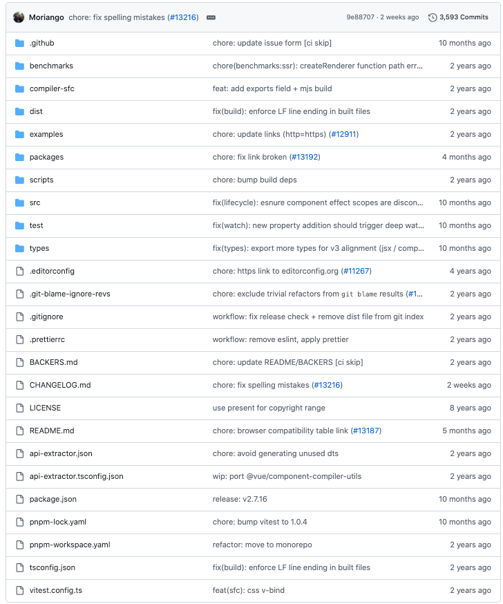

🔥从零手写vue2 - 源码目录结构

本专栏是打算从零手写一个 vue2，并学习 vue2 中的一些核心理念。

[专栏文章一 - 🔥从零手写vue2 - 虚拟节点以及createElement函数](https://juejin.cn/post/7421103437607370806)

[专栏文章二 - 🔥从零手写vue2 - template模板解析](https://juejin.cn/post/7427468776995012627)

# 一、非 vue核心源码目录大体结构

前面 2 节中我们详细介绍了 vue 中的虚拟节点以及模板解析。

但是对 vue2 源码的总体目录结构并没有提及。

所以我们这章就大概描述下 vue2 源码的目录结构是怎么样的。 

> 我们看的 vue源码 版本是 2.7.16 是 vue2 的最新版本

我们打开vue2的[github](https://github.com/vuejs/vue)源码地址。



可以看到其中有很多个目录文件，但是其实 Vue2 源码核心的都是在 src文件夹中的。

我们这章大概介绍一下除了 src 下面的一些目录，了解一下大体的作用是什么。

## 1.1 `.github`

该文件夹用于存放与 gitHub 相关的配置文件或者脚本。 

## 1.2 `benchmarks`

该文件夹用于存放性能基准测试的相关文件和脚本。

> 性能基准测试是一种用来评估软件性能的方法，它通过模拟真实世界中的使用场景来测量软件在不同条件下的表现。
> 
> 可以确保新功能不会降低框架的整体性能，同时也可以用来优化现有代码，使其更加高效。

## 1.3. `compiler-sfc`

该文件夹下的内容逻辑就可以协助 webpack进行解析处理单文件组件（SFC）。

> 通常我们开发时会借助 webpack将 vue文件转化为一个 JS对象。
 
可以查看他的 index.js文件 发现实际上就是导出了`@vue/compiler-sfc`这个包。

```js
module.exports = require('@vue/compiler-sfc')
```

## 1.4. `dist`

该文件夹为打包文件存放的地方。

## 1.5. `examples`

该文件夹用于存放示例应用程序或代码片段，目的是展示 Vue.js 的基本用法和功能。

## 1.6 `packages`

该文件夹主要用于组织 Vue.js 的各个子包或模块。

随着 Vue.js 项目的复杂度增加，将不同的功能模块拆分成独立的子包已经成为了一种常见的做法。

这样不仅有利于模块化开发，还能方便依赖管理和发布。

该目录下有三个目录。

### 1.6.1 `compiler-sfc`

该文件夹下的内容主要用于处理单文件组件。

### 1.6.2 `server-renderer`

该文件夹下的内容和服务端渲染相关的内容。

### 1.6.3 `template-compiler`

该文件夹下的内容存放模板编译相关的逻辑。

## 1.7 `scripts`

该文件夹主要用于存放各种自动化脚本。

这些脚本通常用于辅助项目的构建、测试、发布和其他开发任务。

## 1.8 `src`

该文件夹是存放 vue框架核心源码的地方。

> 后面我们会详细说一下。

## 1.9 `test`

该文件夹主要用于存放各种类型的测试文件，这些测试文件用于验证 Vue.js 框架的功能是否按预期工作。

## 1.10 `types`

该文件夹主要用于存放 TypeScript 类型定义文件。

> 这些类型定义文件为 Vue.js 提供了类型支持，使得在使用 Vue.js 时可以享受静态类型检查的好处，从而提高代码质量和开发效率。

## 1.11 `.editorconfig`

该文件用于指定编辑器应该遵循的一系列编码和格式化规则。

## 1.12 `.git-blame-ignore-revs`

该文件用于告诉 Git 在执行 git blame 命令时忽略某些特定的提交记录。

## 1.13 `.gitignore`

该文件用于指定 Git 应该忽略哪些文件或目录，即不将这些文件或目录纳入版本控制。

## 1.14 `.prettierrc`

该文件用于配置 Prettier。

> Prettier是一个流行的代码格式化工具，旨在帮助开发者保持代码风格的一致性。
>
> Prettier 可以自动格式化代码，使其符合预设的编码规范，从而提高代码的可读性和一致性。

## 1.15 `BACKERS.md`

该文件主要用于记录和支持 Vue.js 项目的赞助者或贡献者。

> 这份文件通常列出了那些通过资金或其他形式支持 Vue.js 发展的个人或组织。

## 1.16 `CHANGELOG.md`

该文件主要用于记录项目的版本变更历史，包括每个版本的新增功能、改进、修复的错误以及其他重要的变更信息。

## 1.17 `LICENSE`

该文件用来定义和声明项目使用的许可协议的文件

## 1.18 `README.md`

该文件为项目的入口文档文件。

> 文件提供了关于项目的概述、安装步骤、使用方法、贡献指南等关键信息。

## 1.19 `api-extractor.json`

该文件用于配置 API Extractor 工具（这是一种用于生成 TypeScript 类型定义文档和 API 报告的工具）

> API Extractor 通常用于大型 TypeScript 项目中，帮助开发者生成详细的 API 文档，并确保类型定义的一致性和准确性。

## 1.20 `api-extractor.tsconfig.json`

该文件用于配置 TypeScript 编译选项，以配合 API Extractor 工具生成 API 文档和类型定义文件。

> 这个文件通常包含了一些特定的 TypeScript 配置，确保 API Extractor 能够正确地解析和处理源代码。

## 1.21 `package.json`

该文件是项目的核心配置文件，用于描述项目的元数据以及项目依赖关系和构建脚本。

## 1.22 `pnpm-lock.yaml`

该文件是由 pnpm 包管理器生成的锁定文件。

用于记录项目中所有依赖项的具体版本信息，以及它们是如何被安装的。

> pnpm 是一种替代 npm 和 yarn 的高性能包管理器，它具有更快的速度和更少的磁盘空间占用。

## 1.23 `pnpm-workspace.yaml`

该文件用于配置 pnpm 工作区（workspace）。

> pnpm 支持多项目的工作区模式，这种模式允许多个相关项目共享依赖，并且可以方便地管理这些项目的依赖关系和构建流程。

## 1.24 `tsconfig.json`

该文件是 TypeScript 编译配置文件，用于定义 TypeScript 编译器在编译源代码时应遵循的选项和规则。

## 1.25 `vitest.config.ts`

该文件用于配置 Vitest 的测试框架配置文件。

Vitest 是一个现代化的 JavaScript 和 TypeScript 测试框架，它提供了快速的测试运行速度和丰富的功能集，适用于前端和后端开发。

# 二、src目录下有什么？

上一章节我们简单介绍了一下非 src文件夹下面的一些文件内容。

这些都是在一个工程化的框架项目中必不可少的部分。

那么本节的内容就是看下 src 文件夹下包含哪些内容。

下面这个目录结构去除了 ts相关的声明文件。

```html
src
├─shared
|   ├─constants.ts
|   └util.ts
├─platforms
|     ├─web
|     |  ├─entry-compiler.ts
|     |  ├─entry-runtime-esm.ts
|     |  ├─entry-runtime-with-compiler-esm.ts
|     |  ├─entry-runtime-with-compiler.ts
|     |  ├─entry-runtime.ts
|     |  ├─runtime-with-compiler.ts
|     |  ├─util
|     |  |  ├─attrs.ts
|     |  |  ├─class.ts
|     |  |  ├─compat.ts
|     |  |  ├─element.ts
|     |  |  ├─index.ts
|     |  |  └style.ts
|     |  ├─runtime
|     |  |    ├─class-util.ts
|     |  |    ├─index.ts
|     |  |    ├─node-ops.ts
|     |  |    ├─patch.ts
|     |  |    ├─transition-util.ts
|     |  |    ├─modules
|     |  |    |    ├─attrs.ts
|     |  |    |    ├─class.ts
|     |  |    |    ├─dom-props.ts
|     |  |    |    ├─events.ts
|     |  |    |    ├─index.ts
|     |  |    |    ├─style.ts
|     |  |    |    └transition.ts
|     |  |    ├─directives
|     |  |    |     ├─index.ts
|     |  |    |     ├─model.ts
|     |  |    |     └show.ts
|     |  |    ├─components
|     |  |    |     ├─index.ts
|     |  |    |     ├─transition-group.ts
|     |  |    |     └transition.ts
|     |  ├─compiler
|     |  |    ├─index.ts
|     |  |    ├─options.ts
|     |  |    ├─util.ts
|     |  |    ├─modules
|     |  |    |    ├─class.ts
|     |  |    |    ├─index.ts
|     |  |    |    ├─model.ts
|     |  |    |    └style.ts
|     |  |    ├─directives
|     |  |    |     ├─html.ts
|     |  |    |     ├─index.ts
|     |  |    |     ├─model.ts
|     |  |    |     └text.ts
├─core
|  ├─config.ts
|  ├─index.ts
|  ├─vdom
|  |  ├─create-component.ts
|  |  ├─create-element.ts
|  |  ├─create-functional-component.ts
|  |  ├─patch.ts
|  |  ├─vnode.ts
|  |  ├─modules
|  |  |    ├─directives.ts
|  |  |    ├─index.ts
|  |  |    └template-ref.ts
|  |  ├─helpers
|  |  |    ├─extract-props.ts
|  |  |    ├─get-first-component-child.ts
|  |  |    ├─index.ts
|  |  |    ├─is-async-placeholder.ts
|  |  |    ├─merge-hook.ts
|  |  |    ├─normalize-children.ts
|  |  |    ├─normalize-scoped-slots.ts
|  |  |    ├─resolve-async-component.ts
|  |  |    └update-listeners.ts
|  ├─util
|  |  ├─debug.ts
|  |  ├─env.ts
|  |  ├─error.ts
|  |  ├─index.ts
|  |  ├─lang.ts
|  |  ├─next-tick.ts
|  |  ├─options.ts
|  |  ├─perf.ts
|  |  └props.ts
|  ├─observer
|  |    ├─array.ts
|  |    ├─dep.ts
|  |    ├─index.ts
|  |    ├─scheduler.ts
|  |    ├─traverse.ts
|  |    └watcher.ts
|  ├─instance
|  |    ├─events.ts
|  |    ├─index.ts
|  |    ├─init.ts
|  |    ├─inject.ts
|  |    ├─lifecycle.ts
|  |    ├─proxy.ts
|  |    ├─render.ts
|  |    ├─state.ts
|  |    ├─render-helpers
|  |    |       ├─bind-dynamic-keys.ts
|  |    |       ├─bind-object-listeners.ts
|  |    |       ├─bind-object-props.ts
|  |    |       ├─check-keycodes.ts
|  |    |       ├─index.ts
|  |    |       ├─render-list.ts
|  |    |       ├─render-slot.ts
|  |    |       ├─render-static.ts
|  |    |       ├─resolve-filter.ts
|  |    |       ├─resolve-scoped-slots.ts
|  |    |       └resolve-slots.ts
|  ├─global-api
|  |     ├─assets.ts
|  |     ├─extend.ts
|  |     ├─index.ts
|  |     ├─mixin.ts
|  |     └use.ts
|  ├─components
|  |     ├─index.ts
|  |     └keep-alive.ts
├─compiler
|    ├─codeframe.ts
|    ├─create-compiler.ts
|    ├─error-detector.ts
|    ├─helpers.ts
|    ├─index.ts
|    ├─optimizer.ts
|    ├─to-function.ts
|    ├─parser
|    |   ├─entity-decoder.ts
|    |   ├─filter-parser.ts
|    |   ├─html-parser.ts
|    |   ├─index.ts
|    |   └text-parser.ts
|    ├─directives
|    |     ├─bind.ts
|    |     ├─index.ts
|    |     ├─model.ts
|    |     └on.ts
|    ├─codegen
|    |    ├─events.ts
|    |    └index.ts
```

# 三、shared文件夹 

```html
src
├─shared
|   ├─constants.ts
|   └util.ts
```
这个文件夹包含了一些在不同环境下都需要共享的工具函数或者常量。

这个工具函数与平台无关。

既可以在客户端使用，也可以在服务端使用，因为它们不依赖于任何特定的环境特性（例如 DOM）。

* constants.ts文件中定义了一些在整个框架内频繁使用的常量，比如特殊的字符串标识符、配置键名等。
* util.ts文件中定义了一些基础的工具函数，比如 isString、isObject和其他一些常用的功能，如深拷贝、警告输出等。

这些文件的主要目的是为了提高代码的可维护性和复用性。

通过将这些功能抽象出来，Vue.js 能够保持核心逻辑的简洁，并且确保不同部分之间的兼容性。

这样做的好处是减少了重复代码，使得代码更容易理解和维护。

# 四、platforms文件夹 

```html
├─platforms
|     ├─web
|     |  ├─entry-compiler.ts
|     |  ├─entry-runtime-esm.ts
|     |  ├─entry-runtime-with-compiler-esm.ts
|     |  ├─entry-runtime-with-compiler.ts
|     |  ├─entry-runtime.ts
|     |  ├─runtime-with-compiler.ts
|     |  ├─util
|     |  |  ├─attrs.ts
|     |  |  ├─class.ts
|     |  |  ├─compat.ts
|     |  |  ├─element.ts
|     |  |  ├─index.ts
|     |  |  └style.ts
|     |  ├─runtime
|     |  |    ├─class-util.ts
|     |  |    ├─index.ts
|     |  |    ├─node-ops.ts
|     |  |    ├─patch.ts
|     |  |    ├─transition-util.ts
|     |  |    ├─modules
|     |  |    |    ├─attrs.ts
|     |  |    |    ├─class.ts
|     |  |    |    ├─dom-props.ts
|     |  |    |    ├─events.ts
|     |  |    |    ├─index.ts
|     |  |    |    ├─style.ts
|     |  |    |    └transition.ts
|     |  |    ├─directives
|     |  |    |     ├─index.ts
|     |  |    |     ├─model.ts
|     |  |    |     └show.ts
|     |  |    ├─components
|     |  |    |     ├─index.ts
|     |  |    |     ├─transition-group.ts
|     |  |    |     └transition.ts
|     |  ├─compiler
|     |  |    ├─index.ts
|     |  |    ├─options.ts
|     |  |    ├─util.ts
|     |  |    ├─modules
|     |  |    |    ├─class.ts
|     |  |    |    ├─index.ts
|     |  |    |    ├─model.ts
|     |  |    |    └style.ts
|     |  |    ├─directives
|     |  |    |     ├─html.ts
|     |  |    |     ├─index.ts
|     |  |    |     ├─model.ts
|     |  |    |     └text.ts
```


## 4.1 为什么会有这么一个platforms目录呢？

platforms 翻译成中文表示“平台“。

因为 vue作为一个跨平台的框架，不仅支持传统的web浏览器环境，还支持其他平台，如服务器渲染（SSR），甚至是非浏览器环境。

因此